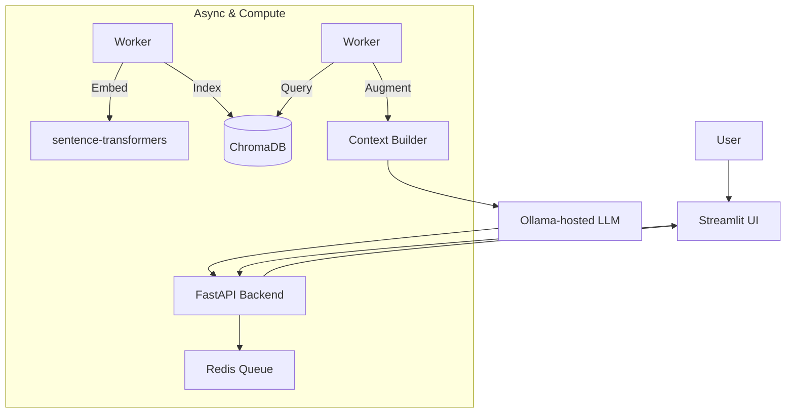

# 👋 Hi, I’m **Anas Limem**

  

  
  
  
  

---

## 🚀 About Me

My expertise lies in engineering production-grade AI systems, encompassing everything from foundational model development and RAG pipeline construction to deploying scalable, cloud-native applications that seamlessly integrate mathematical rigor with software craftsmanship.

- 🧠 Deep Learning, NLP, and RAG systems enthusiast
- 🛠️ From first principles (scratch-built CNNs/optimizers) to production-grade MLOps
- ☁️ Cloud-native thinker: containers, orchestration, observability
- 🤝 Open to collaborating on impactful AI products and research-driven prototypes

---

## 🌟 Featured Projects

### VectorMind AI — Personal Document Q&A Engine
Repo: https://github.com/anaslimem/VectorMind-AI  
- Built an AI app to chat with your documents using RAG
- Streamlit (frontend) + FastAPI (backend), Redis queue for async processing
- ChromaDB for vector storage, sentence-transformers for embeddings, Ollama for LLM
- Containerized with Docker, orchestrated with Kubernetes

---

### AI-Assistant-RAG — RAG-Powered Intelligent Search
Repo: https://github.com/anaslimem/AI-Assistant-RAG  
- Retrieval-Augmented Generation using ChromaDB, LangChain, and Redis
- Streamlit UI for real-time Q&A
- Response optimization and caching for near-instant answers on repeat queries

---

### Smart Article Search v2.0 — AI-Powered News Search
Repo: https://github.com/anaslimem/Smart-Article-Search  
- FastAPI backend + Streamlit frontend
- Elasticsearch for indexing and full-text search
- Dockerized and deployed via Kubernetes (Minikube), ConfigMaps & Secrets

---

### CNN-from-scratch — Pure NumPy Deep Learning
Repo: https://github.com/anaslimem/CNN-from-scratch  
- Convolution, pooling, dropout, batch norm—implemented from scratch
- Manual forward/backward passes and training loop
- Achieved 98% accuracy on MNIST without high-level DL frameworks

---

### Optimizers-from-scratch — Training Without Autograd
Repo: https://github.com/anaslimem/Optimizers-from-scratch  
- Tiny MLP with hand-written backprop and gradient checks
- Optimizers: SGD, Momentum, RMSProp, Adam, AdamW
- Learning-rate schedules: step decay, cosine, warmup (97%+ test accuracy)

---

## 🧭 How I Build AI Systems

- Modular design with queues, workers, and vector stores
- Cloud-native deployments with Docker/Kubernetes
- Clear observability and caching layers for performance

---

## 🧰 Tech Toolbox

  <h3>Languages & Scripting</h3>
  
  
  
  

  <h3>Machine Learning & AI</h3>
  
  
  
  
  
  
  
  

  <h3>Data & Visualization</h3>
  
  
  
  

  <h3>Backend & APIs</h3>
  
  
  

  <h3>Databases & Messaging</h3>
  
  
  

  <h3>DevOps & Cloud</h3>
  
  
  
  

---

## 📚 Currently Exploring

- Reinforcement Learning (RL)
- Advanced RAG architectures and evaluation
- MLOps: experiment tracking, CI/CD for models, data versioning
- Scalable search: embeddings, hybrid retrieval, vector databases

---

## 📈 Stats & Highlights

  

  

  
  

  

---

## 🤝 Connect

---

<i>“The best way to learn is to build.”</i> — Let’s build something intelligent together.

